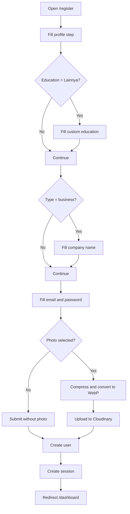

# Activity - Bootcamp Registration

```mermaid
flowchart TD
  A["Open /register"] --> B["Fill profile step"]
  B --> C{"Education = Lainnya?"}
  C -->|"Yes"| D["Fill custom education"]
  C -->|"No"| E["Continue"]
  D --> E
  E --> F{"Type = business?"}
  F -->|"Yes"| G["Fill company name"]
  F -->|"No"| H["Continue"]
  G --> H
  H --> I["Fill email and password"]
  I --> J{"Photo selected?"}
  J -->|"Yes"| K["Compress and convert to WebP"]
  J -->|"No"| L["Submit without photo"]
  K --> M["Upload to Cloudinary"]
  L --> N["Create user"]
  M --> N
  N --> O["Create session"]
  O --> P["Redirect /dashboard"]
```
