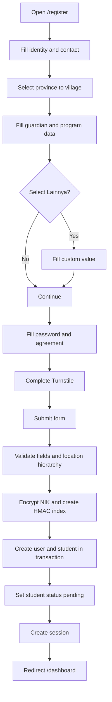

# Activity - Student Registration

```mermaid
flowchart TD
  A["Open /register"] --> B["Fill identity and contact"]
  B --> C["Select province to village"]
  C --> D["Fill guardian and program data"]
  D --> E{"Select Lainnya?"}
  E -->|"Yes"| F["Fill custom value"]
  E -->|"No"| G["Continue"]
  F --> G
  G --> H["Fill password and agreement"]
  H --> I["Complete Turnstile"]
  I --> J["Submit form"]
  J --> K["Validate fields and location hierarchy"]
  K --> L["Encrypt NIK and create HMAC index"]
  L --> M["Create user and student in transaction"]
  M --> N["Set student status pending"]
  N --> O["Create session"]
  O --> P["Redirect /dashboard"]
```
