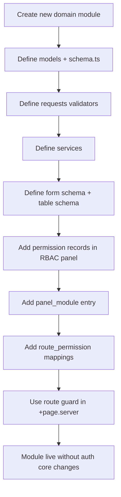

# UML - Activity Module Onboarding

```mermaid
flowchart TD
  A[Create new domain module] --> B[Define models + schema.ts]
  B --> C[Define requests validators]
  C --> D[Define services]
  D --> E[Define form schema + table schema]
  E --> F[Add permission records in RBAC panel]
  F --> G[Add panel_module entry]
  G --> H[Add route_permission mappings]
  H --> I[Use route guard in +page.server]
  I --> J[Module live without auth core changes]
```
