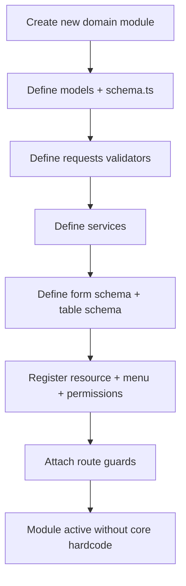

# UML - Activity Module Onboarding

```mermaid
flowchart TD
  A[Create new domain module] --> B[Define models + schema.ts]
  B --> C[Define requests validators]
  C --> D[Define services]
  D --> E[Define form schema + table schema]
  E --> F[Register resource + menu + permissions]
  F --> G[Attach route guards]
  G --> H[Module active without core hardcode]
```
