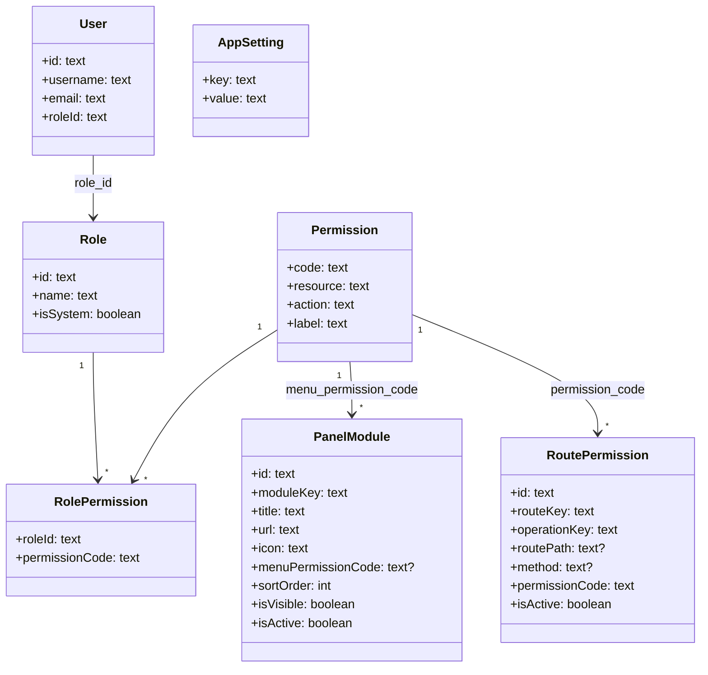

# UML - Domain Class Dynamic LMS

```mermaid
classDiagram
  class User {
    +id: text
    +username: text
    +email: text
    +roleId: text
  }

  class Role {
    +id: text
    +name: text
    +isSystem: boolean
  }

  class Permission {
    +code: text
    +resource: text
    +action: text
    +label: text
  }

  class RolePermission {
    +roleId: text
    +permissionCode: text
  }

  class PanelModule {
    +id: text
    +moduleKey: text
    +title: text
    +url: text
    +icon: text
    +menuPermissionCode: text?
    +sortOrder: int
    +isVisible: boolean
    +isActive: boolean
  }

  class RoutePermission {
    +id: text
    +routeKey: text
    +operationKey: text
    +routePath: text?
    +method: text?
    +permissionCode: text
    +isActive: boolean
  }

  class AppSetting {
    +key: text
    +value: text
  }

  User --> Role : role_id
  Role "1" --> "*" RolePermission
  Permission "1" --> "*" RolePermission
  Permission "1" --> "*" PanelModule : menu_permission_code
  Permission "1" --> "*" RoutePermission : permission_code
```
