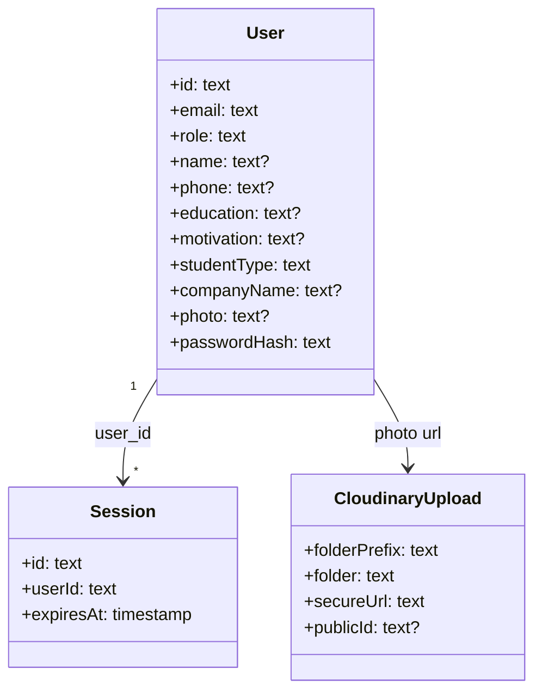

# UML - Domain Class

```mermaid
classDiagram
  class User {
    +id: text
    +email: text
    +role: text
    +name: text?
    +phone: text?
    +education: text?
    +motivation: text?
    +studentType: text
    +companyName: text?
    +photo: text?
    +passwordHash: text
  }

  class Session {
    +id: text
    +userId: text
    +expiresAt: timestamp
  }

  class CloudinaryUpload {
    +folderPrefix: text
    +folder: text
    +secureUrl: text
    +publicId: text?
  }

  User "1" --> "*" Session : user_id
  User --> CloudinaryUpload : photo url
```
