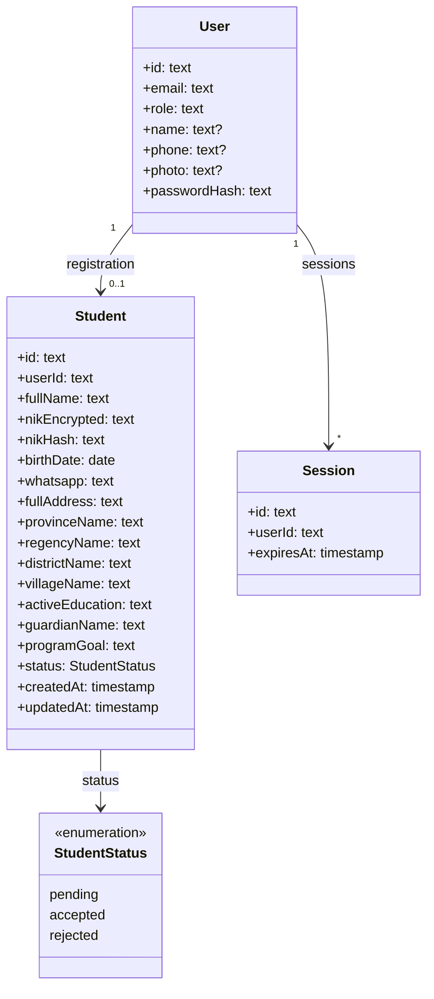

# UML - Domain Class

```mermaid
classDiagram
  class User {
    +id: text
    +email: text
    +role: text
    +name: text?
    +phone: text?
    +photo: text?
    +passwordHash: text
  }

  class Student {
    +id: text
    +userId: text
    +fullName: text
    +nikEncrypted: text
    +nikHash: text
    +birthDate: date
    +whatsapp: text
    +fullAddress: text
    +provinceName: text
    +regencyName: text
    +districtName: text
    +villageName: text
    +activeEducation: text
    +guardianName: text
    +programGoal: text
    +status: StudentStatus
    +createdAt: timestamp
    +updatedAt: timestamp
  }

  class StudentStatus {
    <<enumeration>>
    pending
    accepted
    rejected
  }

  class Session {
    +id: text
    +userId: text
    +expiresAt: timestamp
  }

  User "1" --> "0..1" Student : registration
  User "1" --> "*" Session : sessions
  Student --> StudentStatus : status
```
