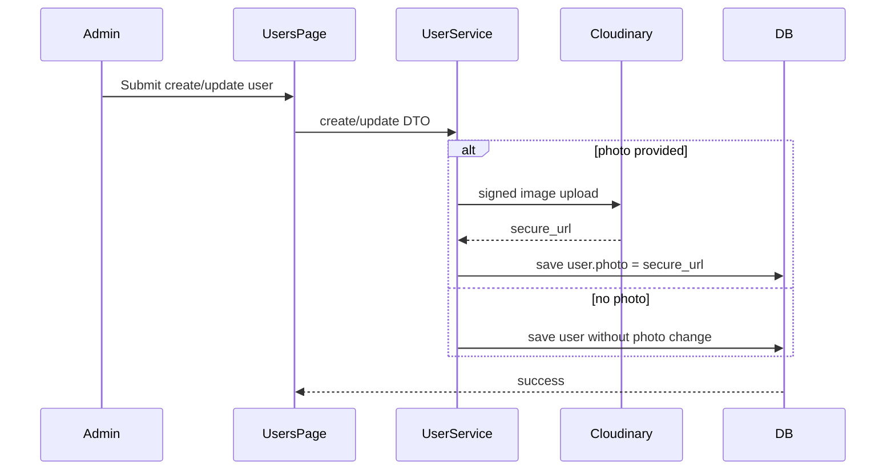

# Sequence - Admin User Photo Upload

```mermaid
sequenceDiagram
  participant Admin
  participant UsersPage
  participant UserService
  participant Cloudinary
  participant DB

  Admin->>UsersPage: Submit create/update user
  UsersPage->>UserService: create/update DTO
  alt photo provided
    UserService->>Cloudinary: signed image upload
    Cloudinary-->>UserService: secure_url
    UserService->>DB: save user.photo = secure_url
  else no photo
    UserService->>DB: save user without photo change
  end
  DB-->>UsersPage: success
```
