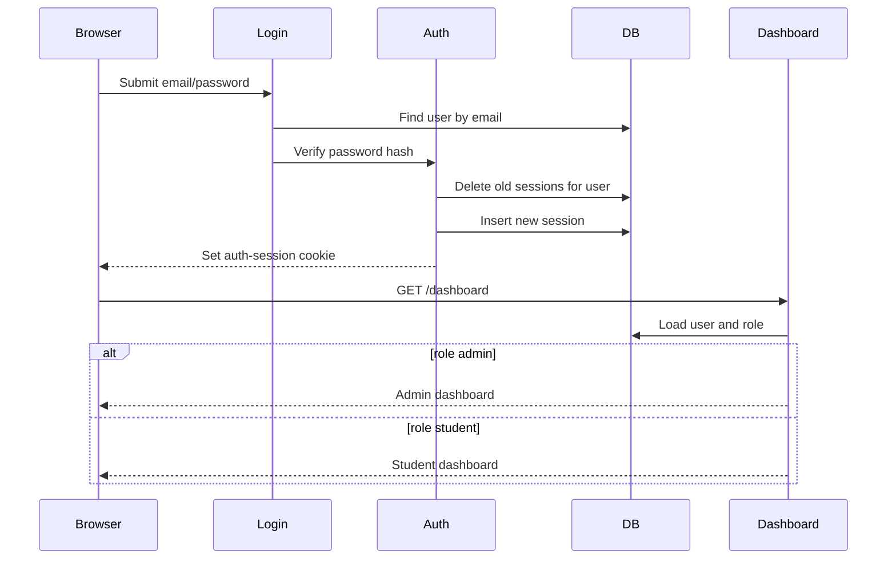

# Sequence - Auth And Shared Dashboard

```mermaid
sequenceDiagram
  participant Browser
  participant Login
  participant Auth
  participant DB
  participant Dashboard

  Browser->>Login: Submit email/password
  Login->>DB: Find user by email
  Login->>Auth: Verify password hash
  Auth->>DB: Delete old sessions for user
  Auth->>DB: Insert new session
  Auth-->>Browser: Set auth-session cookie
  Browser->>Dashboard: GET /dashboard
  Dashboard->>DB: Load user and role
  alt role admin
    Dashboard-->>Browser: Admin dashboard
  else role student
    Dashboard-->>Browser: Student dashboard
  end
```
