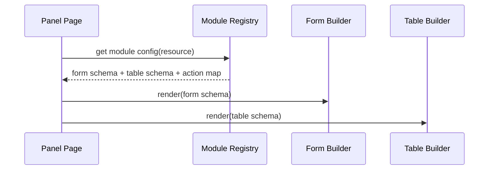

# UML - Sequence Dynamic CRUD Rendering

```mermaid
sequenceDiagram
  participant UI as Panel Page
  participant REG as Module Registry
  participant FB as Form Builder
  participant TB as Table Builder

  UI->>REG: get module config(resource)
  REG-->>UI: form schema + table schema + action map
  UI->>FB: render(form schema)
  UI->>TB: render(table schema)
```
