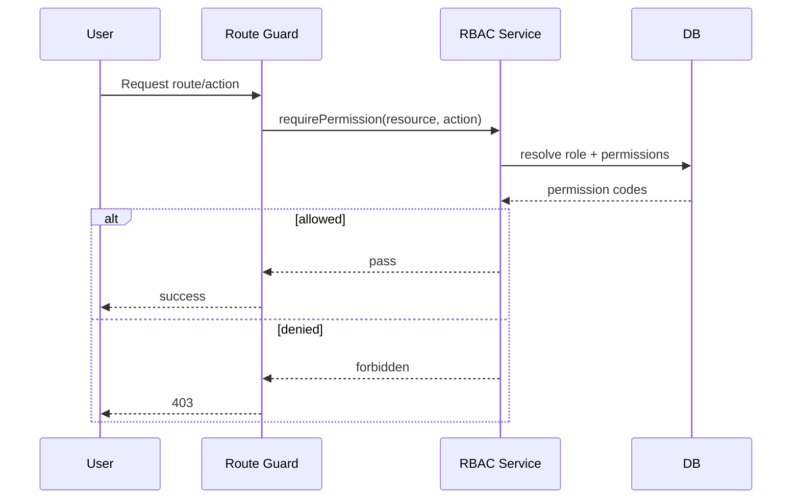

# UML - Sequence RBAC Authorization

```mermaid
sequenceDiagram
  participant U as User
  participant R as Route Guard
  participant S as RBAC Service
  participant D as DB

  U->>R: Request route/action
  R->>S: requirePermission(resource, action)
  S->>D: resolve role + permissions
  D-->>S: permission codes
  alt allowed
    S-->>R: pass
    R-->>U: success
  else denied
    S-->>R: forbidden
    R-->>U: 403
  end
```
