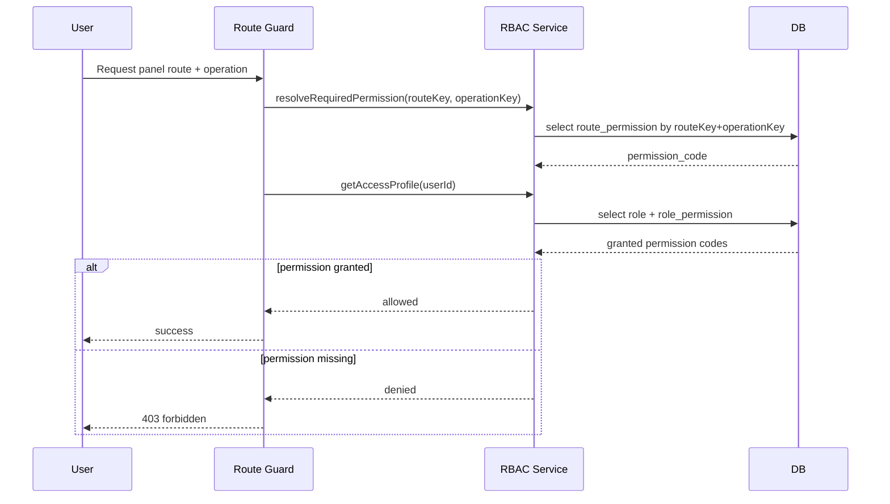

# UML - Sequence RBAC Authorization

```mermaid
sequenceDiagram
  participant U as User
  participant G as Route Guard
  participant S as RBAC Service
  participant D as DB

  U->>G: Request panel route + operation
  G->>S: resolveRequiredPermission(routeKey, operationKey)
  S->>D: select route_permission by routeKey+operationKey
  D-->>S: permission_code
  G->>S: getAccessProfile(userId)
  S->>D: select role + role_permission
  D-->>S: granted permission codes
  alt permission granted
    S-->>G: allowed
    G-->>U: success
  else permission missing
    S-->>G: denied
    G-->>U: 403 forbidden
  end
```
