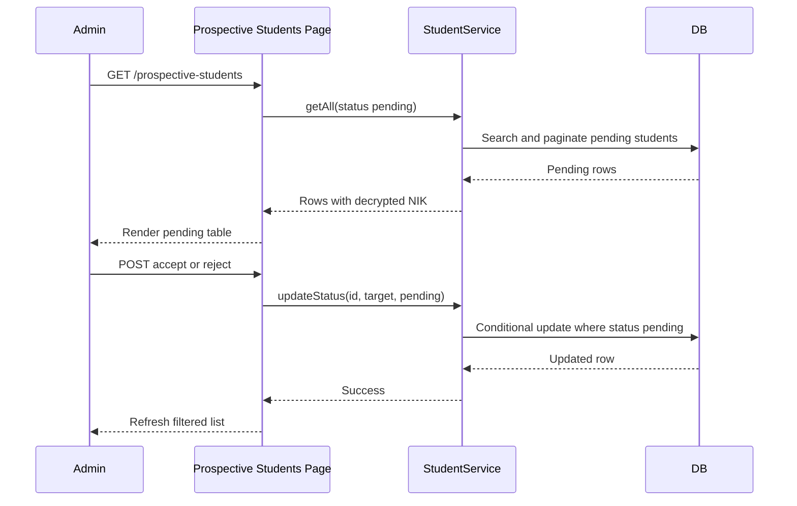

# Sequence - Student Intake Review

```mermaid
sequenceDiagram
  participant Admin
  participant Prospects as Prospective Students Page
  participant Service as StudentService
  participant DB

  Admin->>Prospects: GET /prospective-students
  Prospects->>Service: getAll(status pending)
  Service->>DB: Search and paginate pending students
  DB-->>Service: Pending rows
  Service-->>Prospects: Rows with decrypted NIK
  Prospects-->>Admin: Render pending table

  Admin->>Prospects: POST accept or reject
  Prospects->>Service: updateStatus(id, target, pending)
  Service->>DB: Conditional update where status pending
  DB-->>Service: Updated row
  Service-->>Prospects: Success
  Prospects-->>Admin: Refresh filtered list
```
