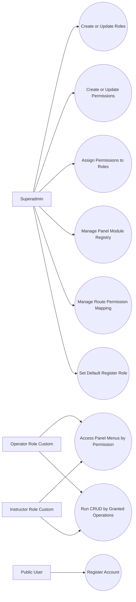

# UML - Use Case Dynamic LMS

```mermaid
flowchart LR
  SA[Superadmin] --> UC1((Create or Update Roles))
  SA --> UC2((Create or Update Permissions))
  SA --> UC3((Assign Permissions to Roles))
  SA --> UC4((Manage Panel Module Registry))
  SA --> UC5((Manage Route Permission Mapping))
  SA --> UC6((Set Default Register Role))

  OP[Operator Role Custom] --> UC7((Access Panel Menus by Permission))
  OP --> UC8((Run CRUD by Granted Operations))

  IN[Instructor Role Custom] --> UC7
  IN --> UC8

  PUB[Public User] --> UC9((Register Account))
```
