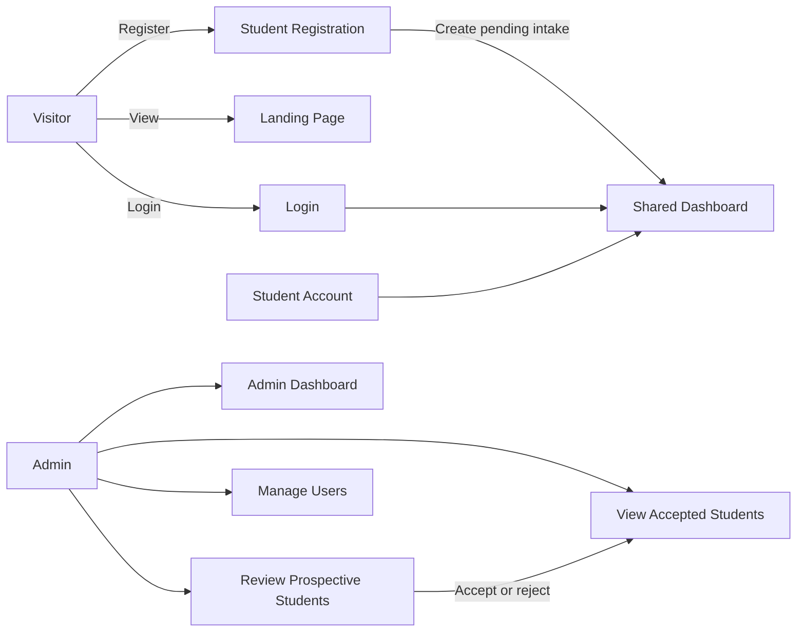

# UML - Use Case

```mermaid
flowchart LR
  Visitor["Visitor"]
  Student["Student Account"]
  Admin["Admin"]

  Visitor -->|"View"| Landing["Landing Page"]
  Visitor -->|"Register"| Register["Student Registration"]
  Visitor -->|"Login"| Login["Login"]

  Register -->|"Create pending intake"| Dashboard["Shared Dashboard"]
  Login --> Dashboard

  Admin --> AdminDashboard["Admin Dashboard"]
  Admin --> Prospects["Review Prospective Students"]
  Admin --> Students["View Accepted Students"]
  Admin --> Users["Manage Users"]
  Prospects -->|"Accept or reject"| Students
  Student --> Dashboard
```
