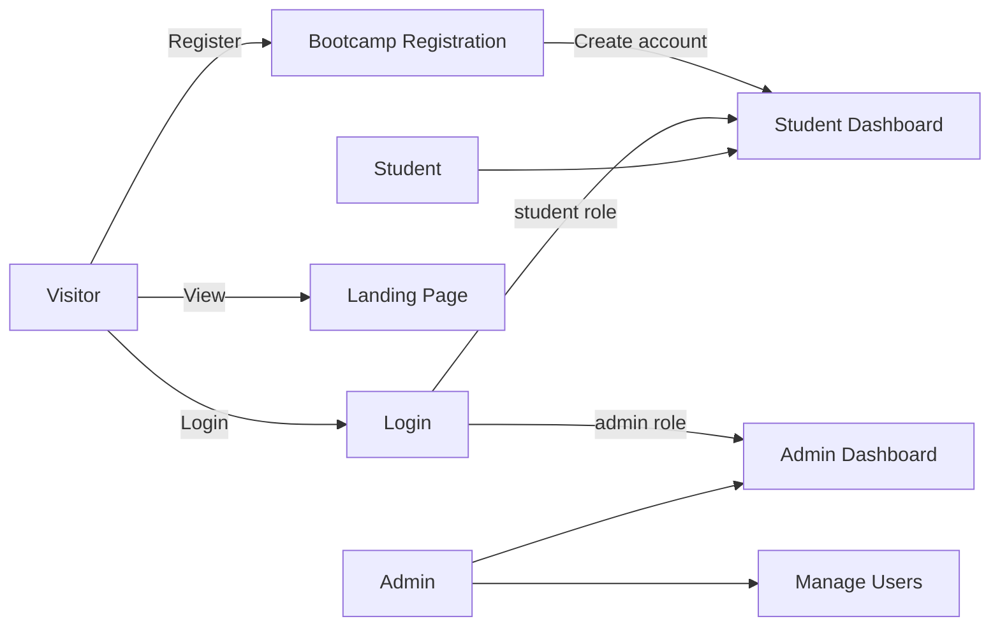

# UML - Use Case

```mermaid
flowchart LR
  Visitor["Visitor"]
  Student["Student"]
  Admin["Admin"]

  Visitor -->|"View"| Landing["Landing Page"]
  Visitor -->|"Register"| Register["Bootcamp Registration"]
  Visitor -->|"Login"| Login["Login"]

  Register -->|"Create account"| StudentDashboard["Student Dashboard"]
  Login -->|"student role"| StudentDashboard
  Login -->|"admin role"| AdminDashboard["Admin Dashboard"]

  Admin --> AdminDashboard
  Admin --> Users["Manage Users"]
  Student --> StudentDashboard
```
