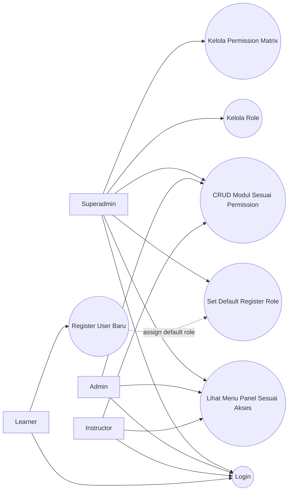

# UML - Use Case RBAC

```mermaid
flowchart LR
    SUPER[Superadmin]
    ADMIN[Admin]
    INSTRUCTOR[Instructor]
    LEARNER[Learner]

    UC1((Login))
    UC2((Lihat Menu Panel Sesuai Akses))
    UC3((CRUD Modul Sesuai Permission))
    UC4((Kelola Role))
    UC5((Kelola Permission Matrix))
    UC6((Set Default Register Role))
    UC7((Register User Baru))

    SUPER --> UC1
    SUPER --> UC2
    SUPER --> UC3
    SUPER --> UC4
    SUPER --> UC5
    SUPER --> UC6

    ADMIN --> UC1
    ADMIN --> UC2
    ADMIN --> UC3

    INSTRUCTOR --> UC1
    INSTRUCTOR --> UC2
    INSTRUCTOR --> UC3

    LEARNER --> UC7
    LEARNER --> UC1

    UC7 -. assign default role .-> UC6
```
