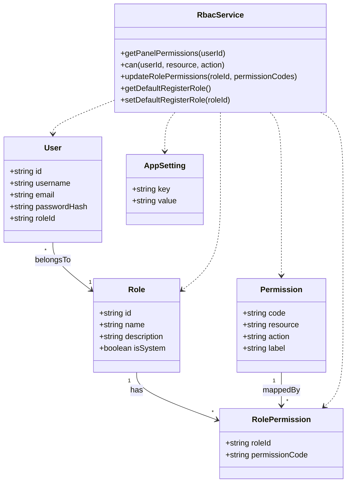

# UML - Domain Class RBAC

```mermaid
classDiagram
    class User {
      +string id
      +string username
      +string email
      +string passwordHash
      +string roleId
    }

    class Role {
      +string id
      +string name
      +string description
      +boolean isSystem
    }

    class Permission {
      +string code
      +string resource
      +string action
      +string label
    }

    class RolePermission {
      +string roleId
      +string permissionCode
    }

    class AppSetting {
      +string key
      +string value
    }

    class RbacService {
      +getPanelPermissions(userId)
      +can(userId, resource, action)
      +updateRolePermissions(roleId, permissionCodes)
      +getDefaultRegisterRole()
      +setDefaultRegisterRole(roleId)
    }

    User "*" --> "1" Role : belongsTo
    Role "1" --> "*" RolePermission : has
    Permission "1" --> "*" RolePermission : mappedBy
    RbacService ..> User
    RbacService ..> Role
    RbacService ..> Permission
    RbacService ..> RolePermission
    RbacService ..> AppSetting
```
