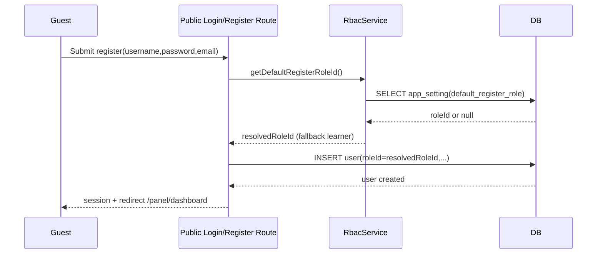

# UML - Sequence Register + Default Role

```mermaid
sequenceDiagram
    participant Guest
    participant LoginRoute as Public Login/Register Route
    participant RbacService
    participant DB

    Guest->>LoginRoute: Submit register(username,password,email)
    LoginRoute->>RbacService: getDefaultRegisterRoleId()
    RbacService->>DB: SELECT app_setting(default_register_role)
    DB-->>RbacService: roleId or null
    RbacService-->>LoginRoute: resolvedRoleId (fallback learner)
    LoginRoute->>DB: INSERT user(roleId=resolvedRoleId,...)
    DB-->>LoginRoute: user created
    LoginRoute-->>Guest: session + redirect /panel/dashboard
```
