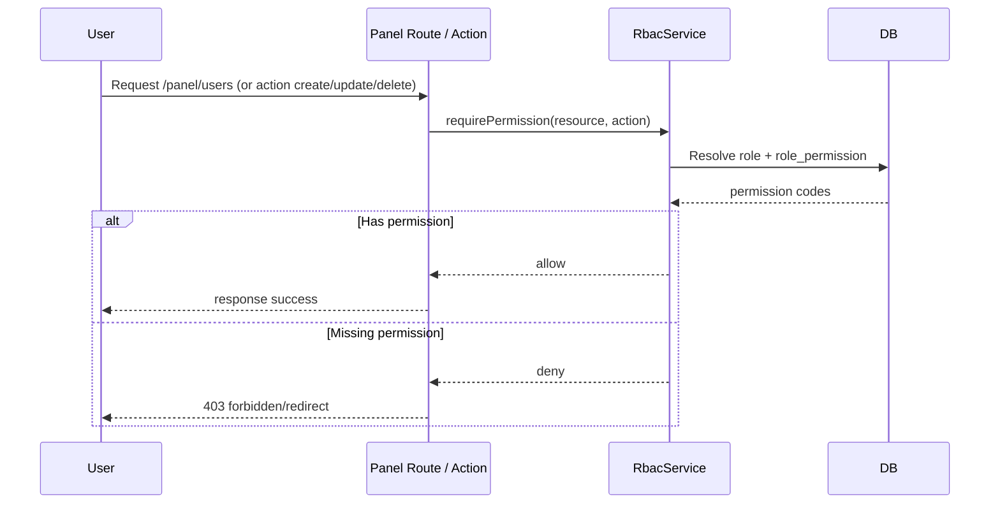

# UML - Sequence Panel Authorization

```mermaid
sequenceDiagram
    participant User
    participant PanelRoute as Panel Route / Action
    participant RbacService
    participant DB

    User->>PanelRoute: Request /panel/users (or action create/update/delete)
    PanelRoute->>RbacService: requirePermission(resource, action)
    RbacService->>DB: Resolve role + role_permission
    DB-->>RbacService: permission codes
    alt Has permission
        RbacService-->>PanelRoute: allow
        PanelRoute-->>User: response success
    else Missing permission
        RbacService-->>PanelRoute: deny
        PanelRoute-->>User: 403 forbidden/redirect
    end
```
