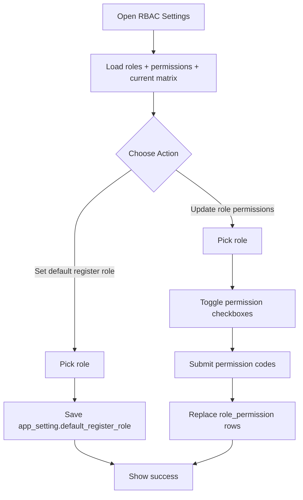

# UML - Activity Superadmin RBAC Settings

```mermaid
flowchart TD
    A[Open RBAC Settings] --> B[Load roles + permissions + current matrix]
    B --> C{Choose Action}

    C -->|Set default register role| D[Pick role]
    D --> E[Save app_setting.default_register_role]
    E --> F[Show success]

    C -->|Update role permissions| G[Pick role]
    G --> H[Toggle permission checkboxes]
    H --> I[Submit permission codes]
    I --> J[Replace role_permission rows]
    J --> F
```
